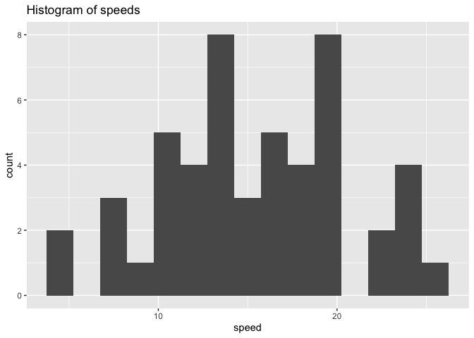
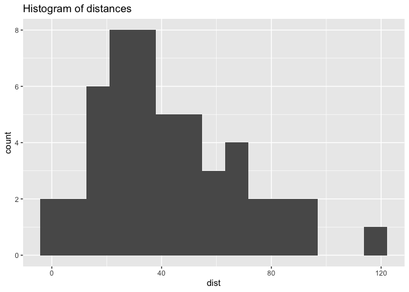
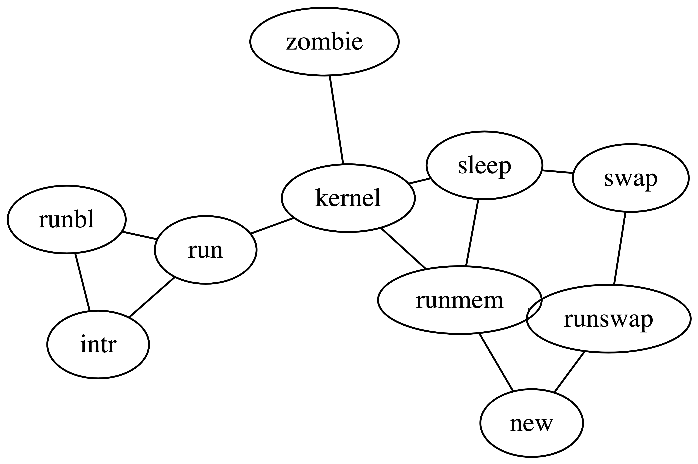

Testing out the stories collection.

Cras mattis consectetur purus sit amet fermentum. Maecenas sed diam eget
risus varius blandit sit amet non magna. Donec ullamcorper nulla non
metus auctor fringilla. Aenean eu leo quam. Pellentesque ornare sem
lacinia quam venenatis vestibulum. Cum sociis natoque penatibus et
magnis dis parturient montes, nascetur ridiculus mus.

### Data Visualization

Quarto works well with `library(urbnthemes)` – the Urban Institute’s R
data visualization theme.

Consider an examples using the `cars` dataset, which contains `speed`
and `dist` for 50. **?@fig-histogram** shows two histograms displaying
the distributions of `speed` and `dist` individually.

``` r
ggplot(cars, aes(x = speed)) +
  geom_histogram(bins = 15) +
  labs(title = "Histogram of speeds")

ggplot(cars, aes(x = dist)) +
  geom_histogram(bins = 15) +
  labs(title = "Histogram of distances")
```





Histograms of individual variables

### Data Tables

The default for df-print is kable. This is the only type of table that
works with the table references. kable works well until there is tons of
data, where paged thrives.

[Table 1](#tbl-stats-kable) displays basic summary statistics for these
two variables.

``` r
cars %>%
  summarise(
    `Median speed` = median(speed),
    `IQR speed` = IQR(speed),
    `Median dist` = median(dist),
    `IQR dist` = IQR(dist),
    `Correlation, r` = cor(speed, dist)
  ) %>%
  kable(digits = c(0, 0, 0, 0, 2))
```

<div id="tbl-stats-kable">

| Median speed | IQR speed | Median dist | IQR dist | Correlation, r |
|-------------:|----------:|------------:|---------:|---------------:|
|           15 |         7 |          36 |       30 |           0.81 |

Table 1: Summary statistics for speed and dist (kable)

</div>

### Diagrams

Quarto has access to Mermaid and Graphviz for creating diagrams. Here is
a simple example from the [Quarto
documentation](https://quarto.org/docs/authoring/diagrams.html):

``` mermaid
flowchart LR
  A[Hard edge] --&gt; B(Round edge)
  B --&gt; C{Decision}
  C --&gt; D[Result one]
  C --&gt; E[Result two]
```

Graphviz

<div>

<div>



</div>

</div>
